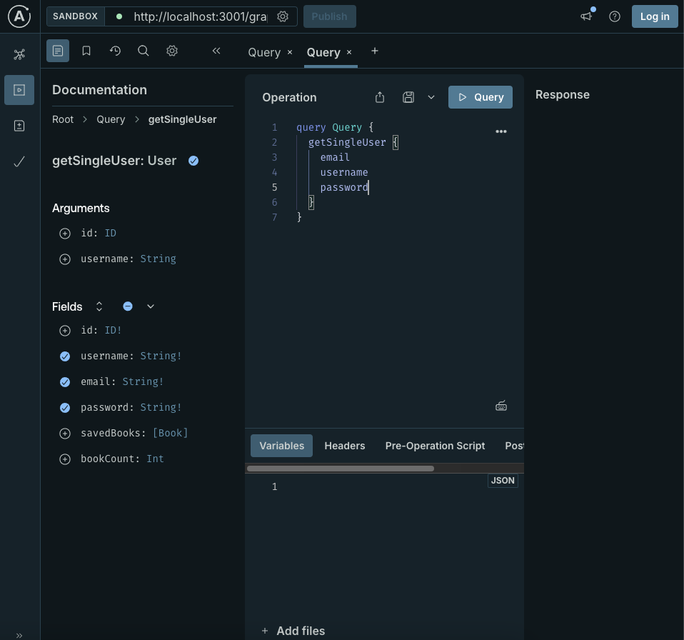
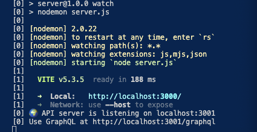
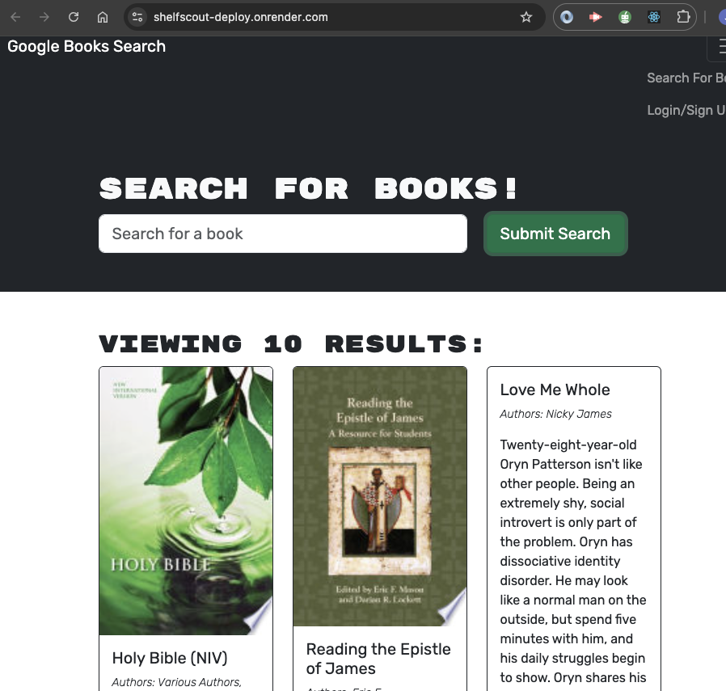

# ShelfScout

## Description

The app's backend has been refactored from traditional RESTful API routes to use GraphQL with Apollo Server, while the front end remains unchanged. The login and signup functions work the same as before utilizing Google's Book API to find any book that's available in their API.

## Technology

## Finished Product

## Acknowledgements

- [lleriayo](https://github.com/Ileriayo/markdown-badges)
- [Home](https://home.aveek.io/GitHub-Profile-Badges/)
- [GitHubProfileBadges](https://home.aveek.io/GitHub-Profile-Badges/)

<a href="#readme-top">back to top</a>

## License

## Live Link

<https://shelfscout-deploy.onrender.com/>

## GitHub Repo

<https://github.com/joegruff16>
